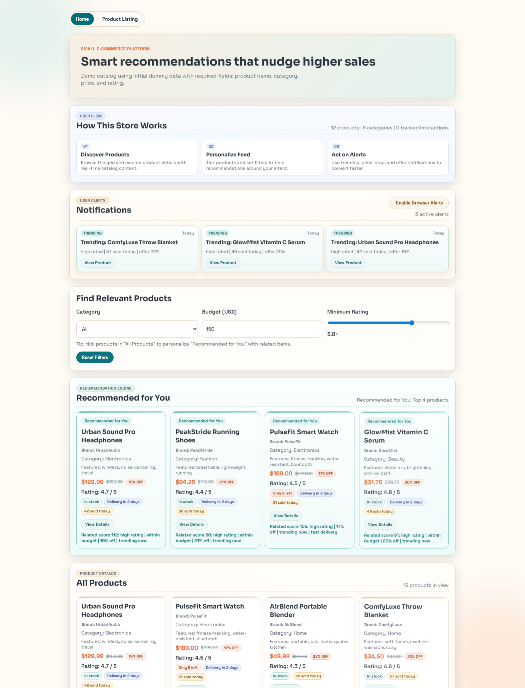
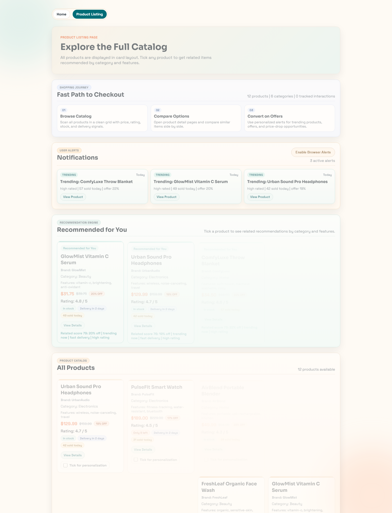
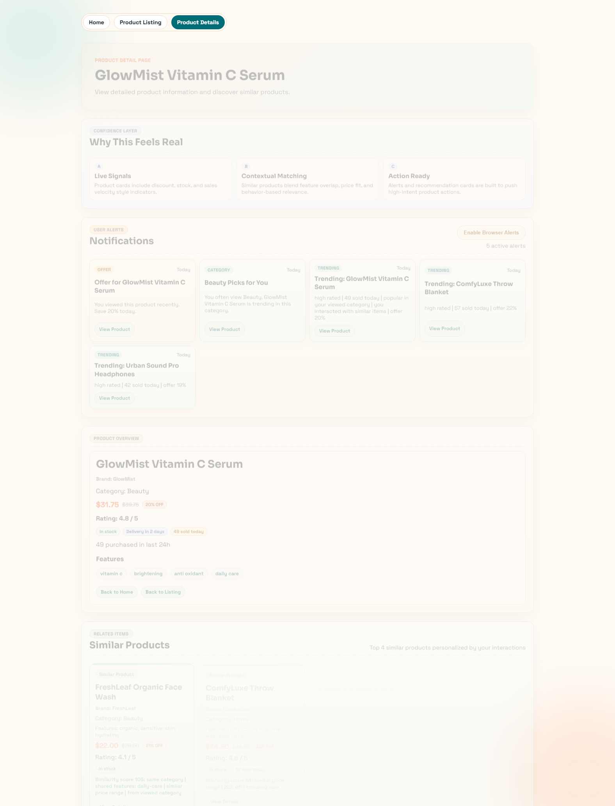

# SmartCart - Intelligent E-Commerce Demo

SmartCart is a frontend e-commerce prototype focused on **conversion-oriented UX** and **behavior-driven recommendations**.  
It combines product relevance scoring, personalization, real-time style shopping signals, and notification alerts.

## Highlights

- Card-first modern storefront UI with clean grid layout
- Personalized recommendations based on:
  - category + feature similarity
  - user interactions (clicked items, viewed categories, recently viewed)
  - commerce signals (discount, demand, stock, delivery speed)
- Product detail page with similar items and contextual ranking
- Notification center for:
  - trending products
  - recently viewed reminders
  - simulated price-drop / offer alerts
- Optional browser notifications (permission-based)

## Core Product Data

Each product includes required base fields:

- `productName`
- `category`
- `price`
- `rating`

And enhanced real-world attributes:

- `brand`
- `originalPrice`
- `inventory`
- `soldLast24h`
- `deliveryDays`
- `features`

## Recommendation Quality Approach

SmartCart uses a hybrid scoring model:

1. Behavioral relevance
   - previously clicked products
   - viewed categories
   - feature affinity from interaction history
2. Context relevance
   - active filter matching (category, budget, min rating)
   - selected product similarity (when user ticks products)
3. Commerce relevance
   - discount depth
   - fast delivery
   - trending velocity (`soldLast24h`)
   - stock urgency
4. Diversity layer
   - category diversity penalty to avoid repetitive recommendation lists

## User Flow

1. Discover products in a catalog grid
2. Personalize feed via filters and product selection toggles
3. Review recommendations and product details
4. Act on smart notifications (trending, offer, price-drop)

## Project Structure

```text
.
|-- index.html
|-- products.html
|-- product-detail.html
|-- styles.css
|-- products-data.js
|-- script.js
|-- products-page.js
|-- product-detail.js
|-- interaction-tracker.js
|-- notifications-engine.js
|-- capture_screenshots.py
|-- screenshots/
|   |-- home.png
|   |-- products.png
|   `-- product-detail.png
```

## Run Locally

No build tools required.

1. Open `index.html` in your browser.
2. Navigate with top links:
   - Home (`index.html`)
   - Product Listing (`products.html`)
   - Product Detail (`product-detail.html?id=<product-id>`)

## Generate Screenshots

Screenshots can be regenerated with:

```bash
python capture_screenshots.py
```

Output images are saved to `screenshots/`.

## Screenshots

### Home


### Product Listing


### Product Detail


## Notes

- Interaction data and notification delivery state are stored in browser `localStorage`.
- Notification offers/price drops are simulated for demo realism.
- Browser push notifications require user permission.
